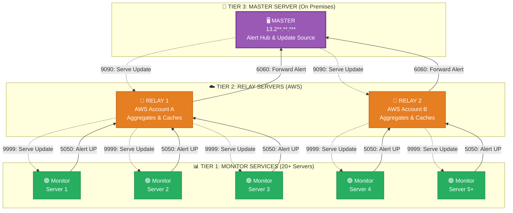

# 🖥️ MagicMonitor — Enterprise Infrastructure Monitoring System

> **Self-healing, zero-touch infrastructure monitoring built for banking-grade production environments.**


---

## 📌 What is MagicMonitor?

MagicMonitor is a **production-grade, self-healing infrastructure monitoring system** deployed across **20+ critical Windows Ec2 instance** in a **banking environment**. It monitors servers 24/7, automatically fixes common issues, and sends real-time alerts — all with **zero manual intervention**.

---

## ⚡ Key Highlights

| Feature | Detail |
|---------|--------|
| 🔄 **Zero-Touch Updates** | New deployments reach all 20+ servers in 2–3 hours automatically |
| 🚨 **Real-Time Alerts** | Detection to email notification in **under 30 seconds** |
| 🤖 **Self-Healing** | Auto-restarts failed processes, auto-expands storage, auto-scales databases |
| 📊 **Full Visibility** | CPU, RAM, Disk, Processes, Patches tracked **24/7/365** |
| 🏦 **Compliance Ready** | RBI audit-ready with 90-day log retention and weekly patch reports |
| 🏗️ **Scalable Design** | 3-tier architecture proven for 20+ servers, built for 100+ |

---

## 🏗️ System Architecture

**3-Tier Distributed Design:**



**Flow Legend:**
- **Solid arrows (→):** Alert flow — Data travels UP (Monitor → Relay → Master)
- **Dashed arrows (-.->):** Update flow — Data travels DOWN (Master → Relay → Monitor)

### Component Details

| Tier | Component | Count | Location | Role |
|------|-----------|-------|----------|------|
| **Tier 3** | Master Server | 1 | On Premises | Central alert hub, email distribution, update source |
| **Tier 2** | Relay Servers | 1 | AWS (one per account) | Alert aggregation, update caching |
| **Tier 1** | Monitor Services | 20+ | Production servers | Real-time monitoring, auto-remediation |

### Port Map

| Port | Direction | Purpose |
|------|-----------|---------|
| **5050** | Monitor → Relay | Alerts & heartbeats sent upstream |
| **9999** | Relay → Monitor | Updates downloaded by monitors |
| **6060** | Relay → Master | Alerts forwarded to central hub |
| **9090** | Master → Relay | Updates downloaded by relays |

### Why 3-Tier?

- ✅ **Fault Isolation** — AWS account boundaries contain failures
- ✅ **Network Efficiency** — Relay caching reduces bandwidth by 20x
- ✅ **Scalability** — Add servers without changing master config
- ✅ **Centralized Control** — One master manages all 20+ servers
... (20+ monitor services total)
TIER 1: MONITOR SERVICES (One per server)

CPU, RAM, Disk, Process monitoring
Auto-restart failed processes
Local Excel reporting
Heartbeat every 20 seconds

**Data Flow:**
- **Alerts Flow UP:** Monitor → Relay (Port 5050) → Master (Port 6060) → Email
- **Updates Flow DOWN:** Master (Port 9090) → Relay → Relay Cache → Monitor (Port 9999)
- **Heartbeat:** Monitor → Relay → Master (Every 20 seconds)

---

## 🛠️ Tech Stack

| Layer | Technology |
|-------|------------|
| **Backend** | C# .NET 6.0, Windows Services |
| **Cloud** | AWS EC2, RDS, VPC (Multi-Account), ap-south-1 (Mumbai) |
| **On-Premises** | Master Server at on Premises |
| **Automation** | Windows Task Scheduler, PowerShell Scripting |
| **Alerting** | SMTP Integration, HTML Email Templates |
| **Reporting** | Automated Excel Generation |
| **Architecture** | Distributed 3-Tier (Master → Relay → Monitor) |

---

## 📈 Impact & Metrics

### Production Results

| Metric | Achievement | Impact |
|--------|-------------|--------|
| 🔻 **Downtime Reduction** | 40-60% | Fewer service outages affecting customers |
| 🤖 **Auto-Remediation** | 70% | Issues fixed without human intervention |
| 💾 **Storage Outages** | 100% prevented | Zero incidents due to disk exhaustion |
| ⚡ **Alert Speed** | <30 seconds | Detection to email notification |
| 📊 **System Uptime** | 99%+ | Across all monitored servers |
| 👥 **Manual Effort** | 80%+ reduction | Time saved on health checks |
| 🖥️ **Coverage** | 20+ servers | Production infrastructure monitored 24/7 |
| 🔄 **Update Speed** | 2-3 Minute | Full fleet deployment time |

### Key Performance Indicators
---

## 🔑 Core Features

### 📡 Real-Time Monitoring

| Metric | Check Frequency | Threshold | Action |
|--------|----------------|-----------|--------|
| **CPU** | Every 40 seconds | >80% | Alert + Excel log |
| **RAM** | Every 50 seconds | >85% | Alert + Excel log |
| **Disk Space** | Interval (Hourly) | Critical: <5 GB<br/>Warning: <10 GB | Alert + possible auto-resize |
| **Process Health** | Every 1 minute | Process stopped | Auto-restart + alert |
| **Heartbeat** | Every 20 seconds | 2 missed (40 sec) | Server down alert |
| **Patches** | Weekly (Saturdays 11:30 PM IST) | N/A | Compliance report |

### 🤖 Intelligent Automation

**Process Auto-Restart:**
- Monitors configured "important processes" every 60 seconds
- Auto-restarts within 1-2 minutes if process fails
- Respects `DoNotStart.flag` for manual override during maintenance
- Sends alerts whether restart succeeds or fails

**RDS Storage Autoscaling:**
- Runs daily at **6:30 AM IST** (off-peak hours)
- Auto-expands storage by **10 GiB** when approaching capacity
- Respects configured maximum storage limits
- Zero downtime during expansion

**EC2 Disk Auto-Resize:**
- Triggers on critical disk space condition (<2 GB)
- Expands EBS volumes automatically via AWS API
- Filesystem extended without server reboot

**Manual Override:**
- Create `DoNotStart_ProcessName.flag` to disable auto-restart
- Used during maintenance, upgrades, or troubleshooting
- Reminder alerts sent every 24 hours while flag exists

### 🔄 Self-Updating System (3-Stage Pipeline)

**Stage 1: Master Preparation (T+0)**

Administrator → Copies new build to C:\Deploy\Updater\Monitor
Master Service → Auto-creates update.zip + version.json
Master → Serves on port 9090

**Stage 2: Relay Caching (T+0 to T+20 min)**

Relay → Checks Master port 9090 every 60 minutes
Relay → Downloads update.zip if newer version available
Relay → Caches in cached_updates\monitor
Relay → Serves to Monitors on port 9999

**Stage 3: Monitor Installation (T+0 to T+30 min)**

Monitor → Checks Relay port 9999 every 60 minutes
Monitor → Downloads update.zip to update_staging
Monitor → Triggers scheduled task "ApplyMonitorUpdate"
Scheduled Task → Stops service → Copies files → Restarts service

**Configuration Protection:**
- `appsettings.json` — **Never overwritten** (server-specific settings)
- `apply_update.cmd` — **Never overwritten** (custom update logic)
- `Logs\` folder — **Never touched** during updates
- Protected via `exclude.txt` used by xcopy command

**UAC Bypass:**
- Scheduled tasks run as `NT AUTHORITY\SYSTEM`
- "Run with highest privileges" enabled
- No user interaction required
- Works even when no user logged in

**Deployment Timeline:** 2-3 hours total for all 20+ servers (natural staggering via 60-min intervals)

### 📊 Reporting & Compliance

**Automated Excel Reports:**
- **CPU Logs:** Minutely with timestamp, CPU%, top 10 processes
- **RAM Logs:** Minutely with timestamp, RAM%, top 10 processes
- **Patch Reports:** Weekly with patch name, install date, KB number
- **Storage:** Local at `C:\Deploy\Monitor\Reports\`
- **Retention:** 90 days recommended

**Email Reports:**
- **Daily Summary:** 6:00 PM IST — All server health, day's alerts, critical issues
- **Monthly Summary:** 1st of month — Trends, uptime stats, capacity planning data
- **Ad-hoc Alerts:** <30 seconds from detection to email

**Compliance Features:**
- 90-day log retention at all tiers (Monitor, Relay, Master)
- Weekly patch compliance tracking (Windows OS + RDS)
- Complete audit trail of all alerts and automated actions
---

## 🧠 Technical Challenges Solved

### 1. UAC Bypass for Automation
**Challenge:** Windows services can't restart themselves or modify their own files while running.  
**Solution:** Windows scheduled tasks with `NT AUTHORITY\SYSTEM` privileges and "Run with highest privileges" flag.

### 2. Configuration Preservation During Updates
**Challenge:** Each of 20+ servers has unique config (relay IP, thresholds, process lists).  
**Solution:** Exclude `appsettings.json` from update.zip and use `exclude.txt` during file copy.

### 3. Network Bandwidth Efficiency
**Challenge:** 20+ monitors downloading 50MB updates from on-premises master = 1GB+ bandwidth.  
**Solution:** Relay-level caching — relay downloads once, serves 20+ monitors locally.

### 4. Multi-Account AWS Isolation
**Challenge:** Monitors in different AWS accounts need to reach same master.  
**Solution:** One relay per AWS account that will connect to master server via internet.

### 5. Zero-Downtime Updates
**Challenge:** Can't take all 20+ servers offline simultaneously.  
**Solution:** Staggered deployment via 60-minute check intervals — natural rollout over 2-3 hours.

### 6. Alert Fatigue Prevention
**Challenge:** Continuous high CPU could spam hundreds of duplicate alerts.  
**Solution:** Smart suppression — alert once when threshold exceeded, alert once when normalized.

---

## 🌐 Network Architecture

### Port Usage Map

| Port | Direction | Data Flow | Purpose |
|------|-----------|-----------|---------|
| **5050** | Monitor → Relay | Alerts travel UP | Monitors send alerts & heartbeats to relay |
| **9999** | Relay → Monitor | Updates travel DOWN | Monitors download updates from relay cache |
| **6060** | Relay → Master | Alerts travel UP | Relays forward aggregated alerts to master |
| **9090** | Master → Relay | Updates travel DOWN | Relays download updates from master |

### Security Configuration

**AWS Security Groups:**
- **Monitors:** Outbound 5050, 9999 to Relay Security Group
- **Relays:** Inbound 5050, 9999 from Monitor SG; Outbound 6060, 9090 to Master IP
- **Master:** Inbound 6060, 9090 from Relay IPs; Outbound 25/587 for SMTP

**Windows Firewall:**
- All components: Allow inbound on listening ports
- All components: Allow outbound on client ports

**Network Topology:**
- VPC Peering between AWS accounts and on-premises (or VPN)
- Private IPs within AWS, public IP for master (firewall-restricted)
- No cross-account communication at monitor level (only via relays)

---

## 🏆 What Makes It Special

✅ **Banking-Grade Production System** — Live in banking environment.  
✅ **Truly Zero-Touch** — From deployment to updates to remediation  
✅ **Resource-Efficient** — Only ~150 MB RAM and <5% CPU per server  
✅ **Hybrid Cloud** — Spans AWS ap-south-1 (Mumbai) and on-premises seamlessly  
✅ **Enterprise Security** — Least-privilege access, firewall-controlled ports, full audit logging  
✅ **Self-Healing** — 70% of issues resolved without human intervention  
✅ **Proven Scalability** — Currently 20+ servers, designed for 100+  

---
---

## 📚 Skills Demonstrated

**Backend Development:**  
`C#` `.NET 6` `Windows Services` `Multithreading` `Async/Await` `Logging`

**Cloud & Infrastructure:**  
`AWS EC2` `AWS RDS` `AWS VPC`  `Security Groups` `Hybrid Cloud`

**DevOps & Automation:**  
`PowerShell` `Windows Task Scheduler` `Service Management` `Automation` 

**System Design:**  
`Distributed Systems` `3-Tier Architecture` `Event-Driven Design` `Fault Tolerance` `Scalability`

**Monitoring & Observability:**  
`Real-Time Monitoring` `Alerting` `Reporting` `Metrics Collection` `Log Aggregation`

**Compliance & Security:**  
`RBI Compliance` `Audit Trails` `Access Control` `Network Security` `Data Retention`

---

## 🚀 Quick Start (Deployment Overview)

### Prerequisites
- Windows Server 2016/2019/2022
- .NET 6.0 Runtime
- Administrator access
- Network ports 5050, 6060, 9090, 9999 open

### Installation Steps

**1. Master Server (AWS Premises)**
```powershell
# Install service
sc.exe create "MasterMonitorService" binPath= "C:\Deploy\Master\MasterService.exe" start= auto
sc.exe start "MasterMonitorService"

# Configure SMTP in appsettings.json
# Open firewall ports 6060, 9090
```

**2. Relay Server (Per AWS Account)**
```powershell
# Install service
sc.exe create "RelayMonitorService" binPath= "C:\Deploy\Relay\RelayService.exe" start= auto
sc.exe start "RelayMonitorService"

# Create scheduled task for self-update
$Action = New-ScheduledTaskAction -Execute "C:\Deploy\Relay\apply_update.cmd"
$Principal = New-ScheduledTaskPrincipal -UserId "NT AUTHORITY\SYSTEM" -RunLevel Highest
Register-ScheduledTask -TaskName "ApplyRelayUpdate" -Action $Action -Principal $Principal

# Configure Master IP in appsettings.json
# Open firewall ports 5050, 9999
```

**3. Monitor Service (Every Server)**
```powershell
# Install service
sc.exe create "MonitorService" binPath= "C:\Deploy\Monitor\MonitorService.exe" start= auto
sc.exe start "MonitorService"

# Create scheduled task for auto-update
$Action = New-ScheduledTaskAction -Execute "C:\Deploy\Monitor\apply_update.cmd"
$Principal = New-ScheduledTaskPrincipal -UserId "NT AUTHORITY\SYSTEM" -RunLevel Highest
Register-ScheduledTask -TaskName "ApplyMonitorUpdate" -Action $Action -Principal $Principal

# Configure Relay IP, thresholds, important processes in appsettings.json
```

---

## 📊 Sample Configuration

**Monitor appsettings.json:**
```json
{
  "ServerName": "PROD-APP-01",
  "RelayServerIP": "10.*.1**",
  "RelayAlertPort": 5050,
  "RelayUpdatePort": 9999,
  "Thresholds": {
    "CpuPercent": 80,
    "RamPercent": 85,
    "DiskCriticalGB": 2,
    "DiskWarningGB": 10
  },
  "ImportantProcesses": [
    "MyBankingApp",
    "PaymentService",
    "APIGateway"
  ],
  "Schedules": {
    "DiskCheckTimes": [ "Interval" ],
    "PatchCheckDay": "Saturday",
    "PatchCheckTime": "23:30",
    "DailyReportTime": "10:00",
    "RdsAutoscaleTime": "06:30"
  }
}
```

---

## 🔧 Troubleshooting

**Service won't start:**
```powershell
# Check .NET Runtime installed
dotnet --list-runtimes

# Check Windows Event Log
Get-EventLog -LogName Application -Source "MonitorService" -Newest 10

# Validate JSON config
Get-Content "C:\Deploy\Monitor\appsettings.json" | ConvertFrom-Json
```

**No alerts received:**
```powershell
# Test network connectivity
Test-NetConnection -ComputerName RelayIP -Port 5050
Test-NetConnection -ComputerName MasterIP -Port 6060

# Check service logs
Get-Content "C:\Deploy\Monitor\Logs\log-*.txt" -Tail 50
```

**Updates not applying:**
```powershell
# Verify scheduled task exists
Get-ScheduledTask -TaskName "ApplyMonitorUpdate"

# Test task manually
Start-ScheduledTask -TaskName "ApplyMonitorUpdate"

# Check staging folder
Get-ChildItem "C:\Deploy\Monitor\update_staging\"
```

---

---
## 👤 Author

**Bhushan Koli** — Cloud Engineer

[](https://github.com/bhushankoli-dev)
[](https://www.linkedin.com/in/bhushan-koli)

📍 Pune, India


---
## 📞 Contact & Support

**Project Maintainer:** Bhushan Koli  
**Role:** Cloud Engineer  
**Location:** Pune, India  

---

---

*Built for reliability. Designed for scale. Proven in production.* 🚀

---

## ⭐ Key Takeaways

- ✅ **3-Tier Architecture** with fault isolation and efficient caching
- ✅ **Sub-30 second alert latency** from detection to email
- ✅ **70% auto-remediation rate** — most issues fixed without humans
- ✅ **Zero-touch updates** across 20+ servers in 2-3 hours
- ✅ **Banking-grade compliance** with RBI audit-ready documentation
- ✅ **99%+ uptime** with <5% CPU and ~150MB RAM overhead per server
