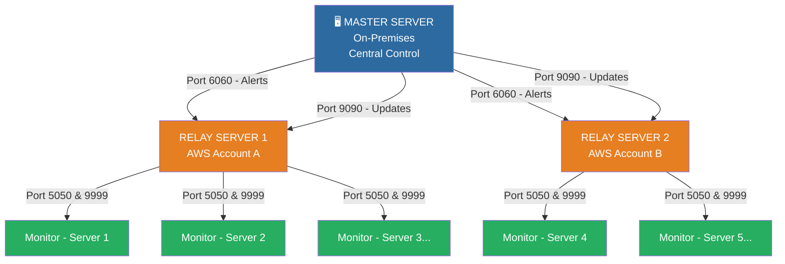

# 🖥️ MagicMonitor — Enterprise Infrastructure Monitoring System

> **Self-healing, zero-touch infrastructure monitoring built for banking-grade production environments.**


---

## 📌 What is MagicMonitor?

MagicMonitor is a **production-grade, self-healing infrastructure monitoring system** deployed across 20+ critical Windows servers in a **banking environment**. It monitors servers 24/7, automatically fixes common issues, and sends real-time alerts — all with **zero manual intervention**.

Built to meet **RBI audit compliance** standards, it replaced manual checks and basic CloudWatch alarms with a fully automated, intelligent monitoring pipeline.

---

## ⚡ Key Highlights

| Feature | Detail |
|---|---|
| 🔄 **Zero-Touch Updates** | New deployments reach all 20+ servers in 2–3 hours automatically |
| 🚨 **Real-Time Alerts** | Detection to email notification in **under 30 seconds** |
| 🤖 **Self-Healing** | Auto-restarts failed processes, auto-expands storage, auto-scales databases |
| 📊 **Full Visibility** | CPU, RAM, Disk, Processes, Patches tracked **24/7/365** |
| 🏦 **Compliance Ready** | RBI audit-ready with 90-day log retention and weekly patch reports |
| 🏗️ **Scalable Design** | 3-tier architecture proven for 20+ servers, built for 100+ |

---

## 🏗️ Architecture — 3-Tier Design



**Why 3-Tier?**
- **Fault Isolation** — AWS account boundaries contain failures
- **Network Efficiency** — Relay caching reduces bandwidth by 20x
- **Scalability** — Add servers without changing master config
- **Centralized Control** — One place to manage all 20+ servers

---

## 🛠️ Tech Stack

| Layer | Technology |
|---|---|
| **Backend** | C# .NET 6.0, Windows Services |
| **Cloud** | AWS EC2, RDS, VPC (Multi-Account) |
| **Automation** | Windows Task Scheduler, PowerShell |
| **Alerting** | SMTP, HTML Email Templates |
| **Reporting** | Automated Excel Generation |
| **Architecture** | Distributed 3-Tier (Master → Relay → Monitor) |

---

## 📈 Impact & Metrics

```
✅  40–60%   reduction in unplanned downtime
✅  70%      issues auto-resolved without human intervention
✅  100%     prevention of storage-related outages
✅  <30 sec  average alert latency (detection → email)
✅  99%+     uptime across all monitored servers
✅  80%+     reduction in manual server health check effort
✅  20+      production servers monitored 24/7
✅  2–3 hrs  full fleet update deployment time
```

---

## 🔑 Core Features

### 📡 Real-Time Monitoring
- **CPU** — Checked every 40 sec, alert at >80%
- **RAM** — Checked every 50 sec, alert at >85%
- **Disk** — Checked twice daily, critical alert at <5 GB free
- **Heartbeat** — Every 20 sec confirms server is alive; failure detected in 40 sec

### 🤖 Intelligent Automation
- **Process Auto-Restart** — Detects stopped critical processes, restarts within 1 minute
- **RDS Storage Expansion** — Daily at 2:30 AM, auto-adds 10 GiB when approaching limit
- **EC2 Disk Auto-Resize** — Expands disk when space runs low, zero downtime
- **Manual Override** — `DoNotStart.flag` disables auto-restart during maintenance

### 🔄 Self-Updating Pipeline
- `appsettings.json` is **never overwritten** — instance configs always preserved
- UAC bypassed using `NT AUTHORITY\SYSTEM` scheduled tasks
- Automatic rollback capability if deployment fails
- All 20+ servers updated in 2–3 hours automatically

### 📊 Reporting & Compliance
- **Daily Reports** — Emailed at 6:00 PM IST with full server health summary
- **Weekly Patch Reports** — Every Saturday 11:30 PM IST, Windows OS + RDS patches
- **Monthly Summaries** — Trends, analysis, and capacity planning data
- **90-Day Log Retention** — Complete audit trail at monitor, relay, and master levels
- **RBI Audit Ready** — Built specifically to satisfy banking regulatory requirements

---

## 🧠 Technical Challenges Solved

1. **UAC Bypass for Automation** — Windows scheduled tasks with SYSTEM privileges
2. **Configuration Preservation** — File exclusion logic protects instance-specific config
3. **Network Efficiency** — Relay-level caching reduces bandwidth by 20x
4. **Multi-Account Isolation** — VPC peering with security boundaries
5. **Zero-Downtime Updates** — Staggered deployment with 60-minute relay intervals
6. **Alert Fatigue Prevention** — Smart suppression rules eliminate duplicate alerts

---

## 🌐 Network Port Map

| Port | Direction | Purpose |
|---|---|---|
| **5050** | Monitor → Relay | Alerts & heartbeats |
| **9999** | Monitor → Relay | Update downloads |
| **6060** | Relay → Master | Alert forwarding |
| **9090** | Relay → Master | Update downloads |

---

## 🏆 What Makes It Special

- **Banking-Grade Production System** — Live banking environment with strict RBI compliance
- **Truly Zero-Touch** — From deployment to updates to remediation, no manual steps
- **Resource-Efficient** — Only ~150 MB RAM and <5% CPU per server
- **Hybrid Cloud** — Spans AWS Mumbai region and on-premises seamlessly
- **Enterprise Security** — Least-privilege access, firewall-controlled ports, full audit logging

---

## 📚 Skills Demonstrated

`C#` `.NET 6` `Windows Services` `AWS EC2` `AWS RDS` `AWS VPC`
`PowerShell` `Distributed Systems` `System Architecture` `DevOps`
`Infrastructure Monitoring` `Auto-Remediation` `High Availability`
`Multi-Account Cloud` `Compliance & Audit` `Banking Infrastructure`

---

## 👤 Author

**Bhushan Koli** — Cloud Engineer
📍 Pune, India

---

*Built for reliability. Designed for scale. Proven in production.* 🚀
